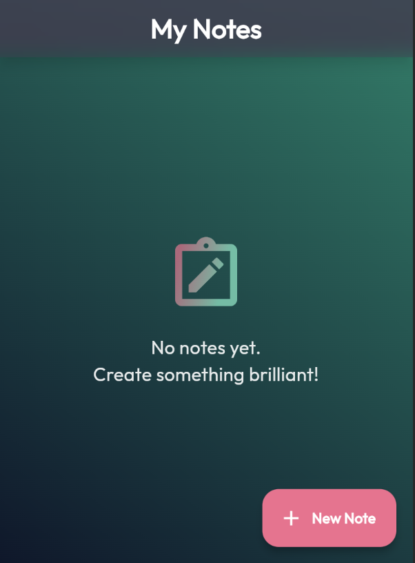
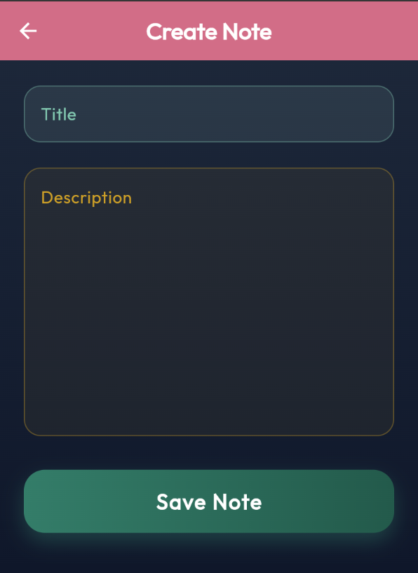
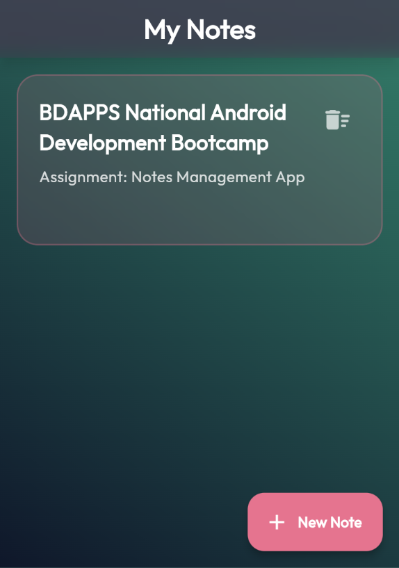
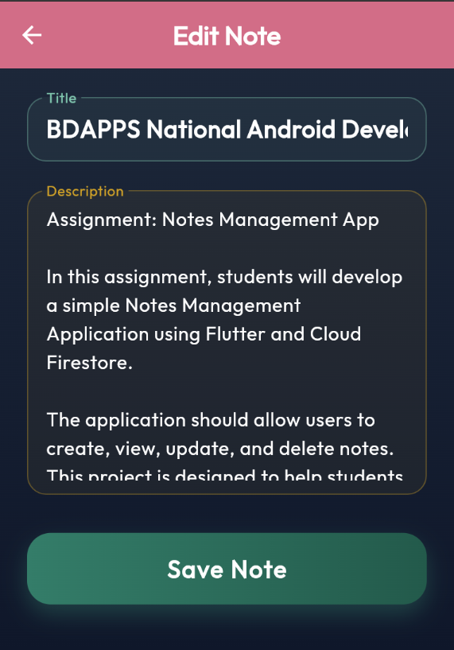

# 📝 Notes Management App

A beautifully designed, feature-rich Notes Management Application built with **Flutter** and **Firebase**. Keep track of your daily tasks, ideas, and important information with a seamless and intuitive user experience.

---

## ✨ Features

- **Create, Read, Update, and Delete (CRUD)**: Easily manage your notes.
- **Real-time Syncing**: Powered by Firebase Cloud Firestore, your notes are always up-to-date across all devices.
- **Beautiful Typography**: Enhanced readability using custom fonts.
- **Smooth Animations**: Engaging and responsive UI interactions crafted for a premium feel.
- **Cross-Platform**: Runs seamlessly on Android, iOS, Web, and Desktop.

## 🛠️ Tech Stack

- **Frontend**: [Flutter](https://flutter.dev/) & Dart
- **Backend & Database**: [Firebase](https://firebase.google.com/) Cloud Firestore
- **Key Packages**:
  - `firebase_core`: Firebase initialization.
  - `cloud_firestore`: Real-time NoSQL database.
  - `google_fonts`: Custom typography.
  - `flutter_animate`: Micro-animations for a highly interactive UI.

## 🚀 Getting Started

### Prerequisites
- [Flutter SDK](https://docs.flutter.dev/get-started/install) (Version 3.12.2 or higher)
- [Dart SDK](https://dart.dev/get-dart)
- A Firebase project configured for this application.

### Installation

1. **Clone the repository:**
   ```bash
   git clone https://github.com/rhsohan/notes_management_app.git
   cd notes_management_app
   ```

2. **Install dependencies:**
   ```bash
   flutter pub get
   ```

3. **Firebase Setup:**
   - Make sure you have your Firebase project set up.
   - Run `flutterfire configure` to generate the necessary `firebase_options.dart` configurations.

4. **Run the app:**
   ```bash
   flutter run
   ```

## 📱 Screenshots

| Home | Add Note | Edit/Delete Note | Save Note |
| :---: | :---: | :---: | :---: |
|  |  |  |  |

## 🤝 Contributing

Contributions, issues, and feature requests are welcome! Feel free to check the [issues page](https://github.com/rhsohan/notes_management_app/issues).

1. Fork the project.
2. Create your feature branch (`git checkout -b feature/AmazingFeature`).
3. Commit your changes (`git commit -m 'Add some AmazingFeature'`).
4. Push to the branch (`git push origin feature/AmazingFeature`).
5. Open a Pull Request.

## 📄 License

Distributed under the MIT License. See `LICENSE` for more information.

---
**Made with ❤️ using Flutter & Firebase.**
